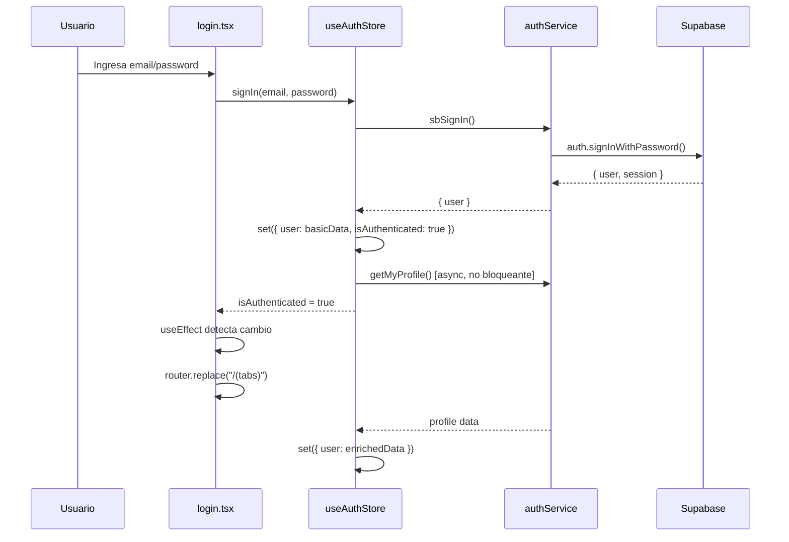
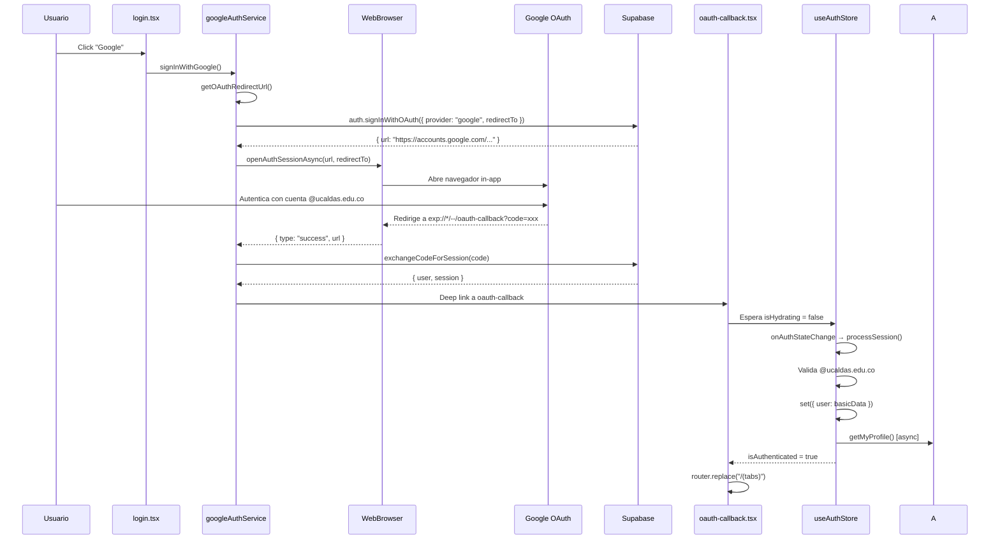

# Sistema de Autenticación UniConnect

## Documento Técnico de Implementación

**Fecha:** 8 de marzo de 2026  
**Versión:** 1.0  
**Autores:** Equipo de Desarrollo UniConnect

---

## Tabla de Contenidos

1. [Resumen Ejecutivo](#resumen-ejecutivo)
2. [Arquitectura del Sistema](#arquitectura-del-sistema)
3. [Componentes Principales](#componentes-principales)
4. [Flujos de Autenticación](#flujos-de-autenticación)
5. [Gestión de Estado](#gestión-de-estado)
6. [Configuración y Despliegue](#configuración-y-despliegue)
7. [Seguridad y Validaciones](#seguridad-y-validaciones)
8. [Troubleshooting](#troubleshooting)
9. [Mejores Prácticas](#mejores-prácticas)

---

## Resumen Ejecutivo

El sistema de autenticación de UniConnect implementa un flujo robusto y no bloqueante que soporta:

- **Autenticación con email/password** para correos institucionales @ucaldas.edu.co
- **Google OAuth** con restricción de dominio automática
- **Gestión de roles** (estudiante/admin) con navegación diferenciada
- **Persistencia de sesión** multiplataforma (Expo Go + builds nativos)
- **Flujo no bloqueante** que permite login instantáneo con carga progresiva de perfil

### Principios de Diseño

1. **Non-blocking First**: Ninguna operación de red bloquea la UI
2. **Progressive Enhancement**: La sesión inicia con datos mínimos y se enriquece progresivamente
3. **Domain Validation**: Validación estricta de correos @ucaldas.edu.co en múltiples capas
4. **Fail-Safe**: El sistema continúa funcionando con datos parciales en caso de errores de red

---

## Arquitectura del Sistema

### Stack Tecnológico

| Capa | Tecnología | Propósito |
|------|------------|-----------|
| Backend Auth | Supabase Auth | Gestión de sesiones, tokens JWT, proveedores OAuth |
| Frontend State | Zustand | Estado global reactivo de autenticación |
| Router | Expo Router v6 | Navegación file-based con Stack |
| OAuth Browser | expo-web-browser | In-app browser para flujos OAuth |
| Deep Linking | expo-auth-session | Generación de redirect URIs |
| Storage | AsyncStorage | Persistencia de sesión (dev/prod) |

### Diagrama de Arquitectura

```
┌─────────────────────────────────────────────────────────────┐
│                      CLIENTE (React Native)                  │
├─────────────────────────────────────────────────────────────┤
│                                                               │
│  ┌──────────────┐      ┌──────────────┐                     │
│  │  app/login   │─────▶│ useAuthStore │◀────┐               │
│  │              │      │   (Zustand)   │     │               │
│  │ email/OAuth  │      └───────┬───────┘     │               │
│  └──────────────┘              │             │               │
│                                 │             │               │
│  ┌──────────────┐      ┌───────▼────────┐   │               │
│  │ app/_layout  │      │  authService    │   │               │
│  │              │──────│                 │───┘               │
│  │ initialize() │      │ googleAuthSvc   │                   │
│  └──────────────┘      └────────┬────────┘                   │
│                                  │                            │
└──────────────────────────────────┼────────────────────────────┘
                                   │
                                   ▼
                   ┌───────────────────────────┐
                   │    SUPABASE AUTH API      │
                   ├───────────────────────────┤
                   │  • signInWithPassword     │
                   │  • signInWithOAuth        │
                   │  • onAuthStateChange      │
                   │  • getSession             │
                   └──────────┬────────────────┘
                              │
                              ▼
                   ┌───────────────────────────┐
                   │   GOOGLE OAUTH SERVER     │
                   │  (identity.google.com)    │
                   └───────────────────────────┘
```

---

## Componentes Principales

### 1. `useAuthStore` (Zustand Store)

**Ubicación:** `frontend/store/useAuthStore.ts`

**Responsabilidades:**
- Mantener el estado global de autenticación
- Escuchar cambios de sesión de Supabase
- Validar dominio @ucaldas.edu.co en todos los flujos
- Cargar perfil completo de forma asíncrona y no bloqueante

**Estados Clave:**

```typescript
{
  user: UserSession | null,        // Datos del usuario autenticado
  isLoading: boolean,               // Indica operación en curso
  isAuthenticated: boolean,         // Usuario validado
  isHydrating: boolean              // Cargando sesión inicial
}
```

**Flujo de Inicialización:**

```typescript
initialize() {
  1. Verificar sesión persistente (supabase.auth.getSession())
  2. Validar dominio @ucaldas.edu.co
  3. Establecer user básico con user_metadata
  4. Lanzar getMyProfile() asíncrono (no bloqueante)
  5. Subscribirse a onAuthStateChange
  6. Actualizar user con datos completos del perfil cuando lleguen
}
```

**Patrón No Bloqueante:**

```typescript
// ❌ BLOQUEANTE (evitado)
const profile = await getMyProfile();
set({ user: profile });

// ✅ NO BLOQUEANTE (implementado)
set({ user: basicUserData });
getMyProfile()
  .then(profile => set({ user: enrichedUserData }))
  .catch(error => console.warn(error));
```

---

### 2. `authService`

**Ubicación:** `frontend/lib/services/authService.ts`

**API Principal:**

| Función | Descripción | Retorno |
|---------|-------------|---------|
| `signUp(email, password, fullName)` | Registro con email institucional | `Promise<AuthResponse>` |
| `signIn(email, password)` | Login con credenciales | `Promise<AuthResponse>` |
| `signOut()` | Cierre de sesión | `Promise<void>` |
| `getMyProfile()` | Perfil completo del usuario | `Promise<AuthProfile \| null>` |
| `onAuthStateChange(callback)` | Escuchar cambios de sesión | `Subscription` |
| `isUcaldasEmail(email)` | Validar dominio institucional | `boolean` |

**Características:**

- **Validación de dominio**: Rechaza emails que no sean @ucaldas.edu.co antes de enviar a Supabase
- **Error handling resiliente**: `getMyProfile()` retorna `null` en caso de error en lugar de lanzar excepción
- **Normalización**: Todos los emails se convierten a lowercase antes de procesarse

---

### 3. `googleAuthService`

**Ubicación:** `frontend/lib/services/googleAuthService.ts`

**Hook Principal:**

```typescript
const { loading, error, signInWithGoogle } = useGoogleAuth();
```

**Flujo OAuth:**

```
1. Usuario presiona "Iniciar sesión con Google"
   ↓
2. getOAuthRedirectUrl() determina redirect URI según entorno:
   • Expo Go: exp://*/--/oauth-callback
   • Native: com.juanse108.uniconnet://oauth-callback
   ↓
3. supabase.auth.signInWithOAuth() con:
   • provider: "google"
   • redirectTo: [redirect URI generado]
   • queryParams: { hd: "ucaldas.edu.co" }
   • skipBrowserRedirect: true
   ↓
4. WebBrowser.openAuthSessionAsync() abre flow OAuth
   ↓
5. Usuario autentica en Google
   ↓
6. Google redirige a oauth-callback con code/tokens
   ↓
7. createSessionFromUrl() procesa:
   • Si hay code: exchangeCodeForSession()
   • Si hay access_token: setSession()
   ↓
8. onAuthStateChange dispara evento SIGNED_IN
   ↓
9. useAuthStore.processSession() completa el login
```

**Gestión de Redirect URIs:**

```typescript
function getOAuthRedirectUrl() {
  // Expo Go (expo start --tunnel/--lan)
  if (Constants.appOwnership === "expo" || Constants.appOwnership === "guest") {
    return AuthSession.makeRedirectUri({ path: "oauth-callback" });
    // Genera: exp://192.168.x.x:8081/--/oauth-callback
  }

  // Build nativo (eas build)
  return AuthSession.makeRedirectUri({
    scheme: "com.juanse108.uniconnet",
    path: "oauth-callback",
  });
  // Genera: com.juanse108.uniconnet://oauth-callback
}
```

---

### 4. Screens de Autenticación

#### `app/login.tsx`

**Características:**
- Dual-mode: Email/password + Google OAuth
- Validación en tiempo real con regex: `/^[a-zA-Z0-9._%+-]+@ucaldas\.edu\.co$/`
- Reactive navigation: `useEffect` escucha `isAuthenticated` y navega automáticamente
- SplashLoader diferenciado por rol durante transición

#### `app/oauth-callback.tsx`

**Propósito:** Pantalla dedicada para manejar el retorno de OAuth sin mostrar onboarding

**Lógica:**
```typescript
1. Esperar 2.5s para que processSession() complete
2. Si isAuthenticated → navegar a /(tabs) o /(admin)
3. Si timeout sin auth → volver a /login
4. Mostrar SplashLoader mientras procesa
```

**¿Por qué es necesario?**

Sin esta pantalla:
```
OAuth callback → app/index.tsx → detecta no auth → /onboarding → flash!
```

Con oauth-callback:
```
OAuth callback → oauth-callback.tsx → espera auth → navegación directa
```

#### `app/index.tsx`

**Responsabilidad:** Router inicial que determina primera pantalla según estado

**Flujo de decisión:**

```typescript
if (isHydrating) {
  return <ActivityIndicator />;
}

if (isAuthenticated && user) {
  if (user.role === "admin") {
    router.replace("/(admin)");
  } else {
    router.replace("/(tabs)");
  }
} else {
  router.replace("/onboarding");
}
```

---

### 5. `useFeed` Hook

**Ubicación:** `frontend/hooks/useFeed.ts`

**Problema Resuelto:** Double-loading del feed

**Causa:** El hook llamaba `getFeedRequests()` antes de que `userSubjectIds` estuvieran cargados, causando:
1. Primera carga: Sin filtros (todos los posts)
2. Segunda carga: Con `userSubjectIds` (posts filtrados)

**Solución:** Flag `subjectsResolved`

```typescript
const [subjectsResolved, setSubjectsResolved] = useState(false);

// 1. Cargar subjects primero
useEffect(() => {
  getEnrolledSubjectsForUser()
    .then(subjects => {
      setUserSubjectIds(subjects.map(s => s.id));
      setSubjectsResolved(true);  // ✅ Habilitar fetchData
    });
}, []);

// 2. fetchData solo se ejecuta cuando subjectsResolved = true
const fetchData = useCallback(async (isRefresh = false) => {
  if (!subjectsResolved) return;  // ⛔ Bloqueo hasta tener subjects
  
  const filters: FeedFilters = {
    search: search.trim(),
    subjectIds: userSubjectIds.length > 0 ? userSubjectIds : undefined,
  };
  
  const data = await getFeedRequests(filters, 0, PAGE_SIZE);
  setRequests(data);
}, [subjectsResolved, userSubjectIds]);
```

**Resultado:** Una sola carga con filtros correctos desde el inicio.

---

## Flujos de Autenticación

### Flujo 1: Email/Password Login



**Tiempo de respuesta:** ~500ms hasta navegación, perfil completo llega en ~1-2s adicionales

---

### Flujo 2: Google OAuth



**Tiempo de respuesta:** ~3-5s (incluye autenticación en Google)

---

### Flujo 3: Logout y Re-login

**Problema Original:** Segunda login congelaba la UI

**Causa:** `await getMyProfile()` bloqueaba el flujo principal

**Solución Implementada:**

```typescript
// ❌ ANTES (bloqueante)
signIn: async (email, password) => {
  const { user } = await sbSignIn({ email, password });
  const profile = await getMyProfile();  // ⛔ BLOQUEO AQUÍ
  set({ user: profile, isAuthenticated: true });
}

// ✅ DESPUÉS (no bloqueante)
signIn: async (email, password) => {
  const { user } = await sbSignIn({ email, password });
  
  // Establecer sesión inmediatamente
  set({ user: basicData, isAuthenticated: true });
  
  // Cargar perfil en background
  getMyProfile()
    .then(profile => set({ user: enrichedData }))
    .catch(error => console.warn(error));
}
```

**Resultado:**
- Primera login: Instantánea
- Logout: Limpia estado
- Segunda login: Instantánea (sin bloqueos)

---

## Gestión de Estado

### Lifecycle de isHydrating

```typescript
// Estado inicial
isHydrating: true

// Durante initialize()
supabase.auth.getSession()  // Verificar sesión persistente
  ↓
processSession(session)
  ↓
set({ isHydrating: false })  // ✅ Hydration completa

// En componentes
if (isHydrating) {
  return <ActivityIndicator />;  // No navegar aún
}

// Listo para routing
router.replace("/destination");
```

**¿Por qué es crítico?**

Previene:
- Flashes de pantallas incorrectas
- Re-navegaciones innecesarias
- Condiciones de carrera entre hydration y user input

---

### Reactive Navigation Pattern

Todos los screens de autenticación usan este patrón:

```typescript
export default function SomeAuthScreen() {
  const isAuthenticated = useAuthStore(s => s.isAuthenticated);
  const user = useAuthStore(s => s.user);
  
  useEffect(() => {
    if (!isAuthenticated || !user) return;
    
    // Navegación diferenciada por rol
    if (user.role === "admin") {
      router.replace("/(admin)");
    } else {
      router.replace("/(tabs)");
    }
  }, [isAuthenticated, user]);
  
  // Render del formulario de login...
}
```

**Ventajas:**
- Funciona para email/password, OAuth, y deep links
- Sin duplicación de lógica de navegación
- Reactivo a cambios de estado desde cualquier fuente

---

## Configuración y Despliegue

### Variables de Entorno

**Archivo:** `frontend/.env.local`

```env
EXPO_PUBLIC_SUPABASE_URL=https://becitrklvpadvjwdbmck.supabase.co
EXPO_PUBLIC_SUPABASE_ANON_KEY=eyJhbGciOiJIUzI1NiIsInR5cCI6IkpXVCJ9...
```

---

### Configuración de Supabase Auth

**Dashboard → Authentication → URL Configuration**

#### Redirect URLs

```
exp://*/--/oauth-callback
exp://*/--/*
com.juanse108.uniconnet://oauth-callback
com.juanse108.uniconnet://*
```

**Explicación:**

| Pattern | Uso |
|---------|-----|
| `exp://*/--/oauth-callback` | Expo Go en tunnel/LAN mode (IP dinámica) |
| `exp://*/--/*` | Fallback para Expo Go |
| `com.juanse108.uniconnet://oauth-callback` | Build nativo (iOS/Android) |
| `com.juanse108.uniconnet://*` | Fallback para build nativo |

**Nota:** El wildcard `*` en `exp://*/--/oauth-callback` permite que funcione con cualquier IP en modo tunnel.

---

### Configuración de Google Cloud OAuth

**Console:** https://console.cloud.google.com/apis/credentials

#### OAuth 2.0 Client ID

**Authorized redirect URIs:**
```
https://becitrklvpadvjwdbmck.supabase.co/auth/v1/callback
```

**Configuración de Consent Screen:**
- User Type: **Internal** (solo @ucaldas.edu.co)
- Scopes: `email`, `profile`, `openid`

**Modo Testing:** Agregar test users manualmente si OAuth consent está en modo "Testing"

---

### Comandos de Desarrollo

#### Iniciar Servidor (Recomendado)

```bash
cd frontend
npx expo start --tunnel
```

**¿Por qué `--tunnel`?**

| Modo | Ventaja | Desventaja | OAuth Funciona |
|------|---------|------------|----------------|
| `--tunnel` | Genera URL pública con ngrok | Más lento | ✅ Sí |
| `--lan` | Red local, rápido | Solo WiFi | ⚠️ Depende |
| Normal | Por defecto | IP localhost | ❌ No |

**OAuth requiere redirect URI accesible desde internet**. Tunnel garantiza esto.

#### Limpiar Cache

```bash
npx expo start --clear
```

#### Build Nativo

```bash
eas build --platform android --profile development
eas build --platform ios --profile development
```

---

## Seguridad y Validaciones

### Capas de Validación de Dominio

#### 1. Frontend - Login Screen (UX)

```typescript
const UCALDAS_REGEX = /^[a-zA-Z0-9._%+-]+@ucaldas\.edu\.co$/;

const handleEmailChange = (value: string) => {
  setEmail(value);
  setEmailError(
    value.length > 0 && !UCALDAS_REGEX.test(value)
      ? "Debe ser un correo @ucaldas.edu.co"
      : ""
  );
};
```

#### 2. authService (Pre-request)

```typescript
export function isUcaldasEmail(email: string): boolean {
  return email.trim().toLowerCase().endsWith("@ucaldas.edu.co");
}

export async function signUp({ email, password, fullName }: SignUpData) {
  if (!isUcaldasEmail(email)) {
    throw new Error("Solo se permiten correos institucionales @ucaldas.edu.co");
  }
  // ... continuar con registro
}
```

#### 3. useAuthStore (Post-auth)

```typescript
const processSession = async (session: any) => {
  if (session?.user) {
    const email = session.user.email?.toLowerCase();

    if (!email?.endsWith('@ucaldas.edu.co')) {
      console.warn("Usuario rechazado: no es de ucaldas.edu.co");
      await supabase.auth.signOut();  // ⛔ Forzar logout
      set({ user: null, isAuthenticated: false });
      return;
    }
    // ... continuar procesamiento
  }
};
```

#### 4. Google OAuth (Cloud Config)

```typescript
queryParams: {
  hd: "ucaldas.edu.co"  // Hosted Domain restriction
}
```

#### 5. Supabase RLS (Backend)

```sql
-- En tabla profiles
CREATE POLICY "Solo usuarios @ucaldas.edu.co"
ON profiles FOR ALL
USING (
  auth.email() LIKE '%@ucaldas.edu.co'
);
```

**Resultado:** Validación en 5 niveles garantiza que solo usuarios institucionales accedan.

---

### Gestión de Tokens

**Supabase maneja automáticamente:**
- Access tokens (JWT, 1h de vida)
- Refresh tokens (rotación automática)
- Token storage en AsyncStorage/SecureStore

**Desarrollador no necesita:**
- Implementar refresh logic
- Manejar expiración manual
- Almacenar tokens manualmente

**Supabase SDK se encarga de:**
```typescript
// Automático en cada request
supabase.auth.getSession()  // Refresca si está por expirar
```

---

## Troubleshooting

### Problema 1: "Login congela en segundo intento"

**Síntomas:**
- Primera login funciona
- Logout exitoso
- Segunda login congela con spinner infinito

**Causa:** Operación bloqueante `await getMyProfile()` en flujo crítico

**Solución:**
```typescript
// Cambiar de await bloqueante a .then() no bloqueante
set({ user: basicData, isAuthenticated: true });
getMyProfile()
  .then(profile => set({ user: enrichedData }))
  .catch(error => console.warn(error));
```

---

### Problema 2: "OAuth redirige a example.com"

**Síntomas:**
- Google auth completa
- Redirige a `https://example.com` en lugar de la app

**Causa:** `redirectTo` no coincide con Allowed Redirect URLs en Supabase

**Solución:**
1. Verificar que `getOAuthRedirectUrl()` genera URL correcta
2. Agregar pattern exacto a Supabase:
   ```
   exp://*/--/oauth-callback  ← Con wildcard *
   ```
3. Usar `--tunnel` en desarrollo:
   ```bash
   npx expo start --tunnel
   ```

**Debug:**
```typescript
const redirectUrl = getOAuthRedirectUrl();
console.warn("Redirect URL local:", redirectUrl);
// Comparar con lo que llega a Supabase
```

---

### Problema 3: "Flash de onboarding en OAuth callback"

**Síntomas:**
- Google auth completa
- Muestra onboarding por 1 segundo
- Luego navega a feed

**Causa:** `app/index.tsx` ejecuta antes de que OAuth procese sesión

**Solución:** Crear `oauth-callback.tsx` dedicado

```typescript
export default function OAuthCallbackScreen() {
  const [waitExpired, setWaitExpired] = useState(false);
  
  useEffect(() => {
    const t = setTimeout(() => setWaitExpired(true), 2500);
    return () => clearTimeout(t);
  }, []);

  useEffect(() => {
    if (isAuthenticated && user) {
      router.replace("/(tabs)");
      return;
    }
    if (!isHydrating && waitExpired) {
      router.replace("/login");
    }
  }, [isHydrating, isAuthenticated, user, waitExpired]);

  return <SplashLoader message="Iniciando sesión..." />;
}
```

---

### Problema 4: "Feed carga dos veces"

**Síntomas:**
- Feed muestra todos los posts
- 1 segundo después filtra por materias del usuario

**Causa:** `useFeed` ejecuta antes de cargar `userSubjectIds`

**Solución:** Flag `subjectsResolved`

```typescript
const [subjectsResolved, setSubjectsResolved] = useState(false);

const fetchData = useCallback(async () => {
  if (!subjectsResolved) return;  // ⛔ Bloquear hasta tener subjects
  // ... fetch con filtros
}, [subjectsResolved, userSubjectIds]);
```

---

### Problema 5: "expo start normal no permite OAuth"

**Síntomas:**
- Google auth falla con error de redirect
- Solo funciona con `--tunnel`

**Causa:** OAuth requiere redirect URI accesible públicamente

**Explicación:**

| Modo | Redirect URI generado | Acceso desde Google |
|------|----------------------|---------------------|
| Normal | `exp://localhost:8081/--/oauth-callback` | ❌ Localhost no es público |
| `--lan` | `exp://192.168.1.5:8081/--/oauth-callback` | ⚠️ Solo si Google puede acceder a tu red |
| `--tunnel` | `exp://abc123.ngrok.io/--/oauth-callback` | ✅ URL pública accesible |

**Solución:** Siempre usar `--tunnel` para desarrollo con OAuth

```bash
npx expo start --tunnel
```

---

## Mejores Prácticas

### 1. Arquitectura No Bloqueante

**Principio:** Nunca bloquear el main thread con operaciones de red

```typescript
// ✅ CORRECTO
const handleAction = async () => {
  set({ loading: true });
  
  // Operación crítica (bloqueante solo si es esencial)
  const result = await criticalOperation();
  set({ data: result });
  
  // Operaciones secundarias (no bloqueantes)
  secondaryOperation()
    .then(data => set({ secondary: data }))
    .catch(error => console.warn(error));
  
  set({ loading: false });
};

// ❌ INCORRECTO
const handleAction = async () => {
  set({ loading: true });
  const result1 = await operation1();
  const result2 = await operation2();  // ⛔ Bloquea UI innecesariamente
  const result3 = await operation3();
  set({ loading: false });
};
```

---

### 2. Estado de Hydration

**Regla:** Nunca tomar decisiones de routing mientras `isHydrating = true`

```typescript
// ✅ CORRECTO
useEffect(() => {
  if (isHydrating) return;  // ⛔ Esperar hydration
  
  if (isAuthenticated) {
    router.replace("/(tabs)");
  } else {
    router.replace("/login");
  }
}, [isHydrating, isAuthenticated]);

// ❌ INCORRECTO
useEffect(() => {
  if (isAuthenticated) {
    router.replace("/(tabs)");
  }
  // Sin verificar isHydrating puede navegar prematuramente
}, [isAuthenticated]);
```

---

### 3. Validación Defensiva

**Principio:** Validar en múltiples capas (defensa en profundidad)

```typescript
// Capa 1: UX (inmediata)
<AuthInput error={emailError} />

// Capa 2: Pre-request (antes de enviar)
if (!isUcaldasEmail(email)) throw new Error("...");

// Capa 3: Post-auth (después de login)
if (!session.user.email.endsWith('@ucaldas.edu.co')) {
  await supabase.auth.signOut();
}

// Capa 4: Backend (RLS policies)
```

---

### 4. Error Handling Resiliente

**Principio:** El sistema debe continuar funcionando con datos parciales

```typescript
// ✅ CORRECTO: Retornar null en lugar de throw
export async function getMyProfile(): Promise<AuthProfile | null> {
  try {
    const { data, error } = await supabase.from("profiles")...
    if (error) {
      console.warn("Error al obtener perfil:", error.message);
      return null;  // ✅ Permite continuar
    }
    return data;
  } catch (error) {
    console.warn("Excepción en getMyProfile:", error);
    return null;  // ✅ Fail-safe
  }
}

// ❌ INCORRECTO: Lanzar excepción bloquea todo
export async function getMyProfile(): Promise<AuthProfile> {
  const { data, error } = await supabase.from("profiles")...
  if (error) throw error;  // ⛔ Bloquea flujo principal
  return data;
}
```

---

### 5. Navegación Reactiva Unificada

**Principio:** Un solo patrón de navegación para todos los flujos

```typescript
// ✅ CORRECTO: useEffect unificado
useEffect(() => {
  if (!isAuthenticated || !user) return;
  
  // Lógica centralizada
  const destination = user.role === "admin" ? "/(admin)" : "/(tabs)";
  router.replace(destination);
}, [isAuthenticated, user]);

// ❌ INCORRECTO: Lógica duplicada
const handleEmailLogin = async () => {
  await signIn(email, password);
  router.replace("/(tabs)");  // ⛔ Duplicado
};

const handleGoogleLogin = async () => {
  await signInWithGoogle();
  router.replace("/(tabs)");  // ⛔ Duplicado
};
```

---

## Apéndices

### A. Estructura de Archivos

```
frontend/
├── app/
│   ├── _layout.tsx              # Root layout, inicializa auth
│   ├── index.tsx                # Entry router
│   ├── login.tsx                # Login dual (email + OAuth)
│   ├── oauth-callback.tsx       # OAuth redirect handler
│   ├── onboarding.tsx           # Primera vez
│   ├── (tabs)/                  # Estudiantes
│   │   ├── feed.tsx
│   │   ├── perfil.tsx
│   │   └── ...
│   └── (admin)/                 # Administradores
│       └── index.tsx
├── store/
│   └── useAuthStore.ts          # Estado global Zustand
├── lib/
│   ├── supabase.ts              # Cliente Supabase
│   └── services/
│       ├── authService.ts       # Email/password auth
│       └── googleAuthService.ts # OAuth flow
└── hooks/
    └── useFeed.ts               # Feed data con auth integration
```

---

### B. Variables de Estado Completas

```typescript
// useAuthStore
{
  user: {
    id: string,
    email: string,
    fullName: string,
    avatarUrl: string | null,
    phoneNumber: string | null,
    role: "estudiante" | "admin",
    semester: number | null,
    bio: string | null,
  } | null,
  isLoading: boolean,        // Operación en curso (signIn, signOut)
  isAuthenticated: boolean,  // Usuario validado
  isHydrating: boolean,      // Cargando sesión inicial
  
  // Métodos
  signIn: (email, password) => Promise<void>,
  signUp: (email, password, fullName) => Promise<void>,
  signOut: () => Promise<void>,
  setUser: (user) => void,
  initialize: () => () => void,
}

// useGoogleAuth
{
  loading: boolean,          // OAuth flow en proceso
  error: string | null,      // Error de autenticación
  signInWithGoogle: () => Promise<void>,
}

// useFeed
{
  filtered: FeedStudyRequest[],
  userSubjects: Subject[],
  loading: boolean,
  refreshing: boolean,
  loadingMore: boolean,
  error: string | null,
  search: string,
  selectedSubjects: string[],
  activeFilters: number,
  
  // Métodos
  setSearch: (v: string) => void,
  setSelectedSubjects: (v: string[]) => void,
  refresh: () => void,
  loadMore: () => void,
}
```

---

### C. Configuración de Supabase Completa

#### Authentication Settings

```
Site URL: exp://localhost:8081
Additional Redirect URLs:
  exp://*/--/oauth-callback
  exp://*/--/*
  com.juanse108.uniconnet://oauth-callback
  com.juanse108.uniconnet://*

Enable Email Provider: Yes
Enable Email Confirmations: Yes
Enable Google Provider: Yes
  Client ID: [Google Cloud OAuth Client ID]
  Client Secret: [Google Cloud OAuth Secret]
```

#### RLS Policies (profiles table)

```sql
-- Usuarios solo ven su propio perfil
CREATE POLICY "Users can view own profile"
ON profiles FOR SELECT
USING (auth.uid() = id AND auth.email() LIKE '%@ucaldas.edu.co');

-- Usuarios pueden actualizar su propio perfil
CREATE POLICY "Users can update own profile"
ON profiles FOR UPDATE
USING (auth.uid() = id AND auth.email() LIKE '%@ucaldas.edu.co');
```

---

### D. Checklist de Deployment

#### Pre-deployment

- [ ] Variables de entorno configuradas en Supabase/EAS
- [ ] Redirect URLs agregadas en Supabase Dashboard
- [ ] Google OAuth Client ID configurado con redirect correcto
- [ ] RLS policies habilitadas en todas las tablas
- [ ] Email confirmation template personalizado

#### Testing

- [ ] Login con email/password funciona
- [ ] Google OAuth funciona (modo tunnel)
- [ ] Logout → Re-login funciona sin bloqueos
- [ ] OAuth no muestra flash de onboarding
- [ ] Feed carga una sola vez con filtros correctos
- [ ] Navegación admin vs estudiante funciona
- [ ] Errores de red no bloquean UI

#### Build Nativo

- [ ] `eas build` completa correctamente
- [ ] Deep links registrados en app.json:
  ```json
  {
    "scheme": "com.juanse108.uniconnet",
    "intentFilters": [
      {
        "action": "VIEW",
        "data": [
          { "scheme": "com.juanse108.uniconnet" }
        ]
      }
    ]
  }
  ```
- [ ] OAuth funciona en build nativo
- [ ] Session persiste correctamente

---

## Conclusión

El sistema de autenticación de UniConnect implementa un flujo robusto, no bloqueante y multiplataforma que:

1. **Soporta múltiples proveedores** (email/password + Google OAuth)
2. **Valida dominio institucional** en 5 capas de seguridad
3. **Nunca bloquea la UI** con operaciones de red
4. **Funciona en Expo Go y builds nativos** con redirect URIs adaptativos
5. **Maneja errores gracefully** continuando con datos parciales

**Principios clave implementados:**
- Non-blocking async flows
- Progressive enhancement
- Defensive validation
- Fail-safe error handling
- Reactive navigation

Este documento debe servir como referencia para:
- Onboarding de nuevos desarrolladores
- Debugging de issues de autenticación
- Extensión del sistema (e.g., agregar Facebook OAuth)
- Auditorías de seguridad

---

**Documento generado:** 8 de marzo de 2026  
**Última actualización:** Sistema en producción estable  
**Contacto:** Equipo UniConnect Dev
